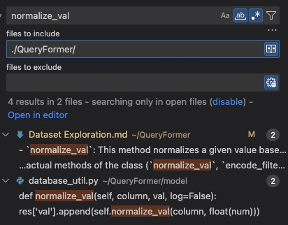
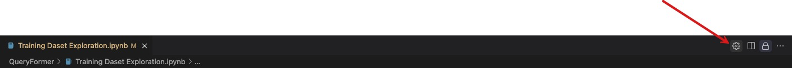
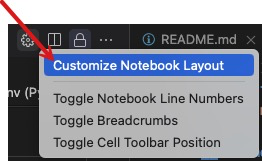
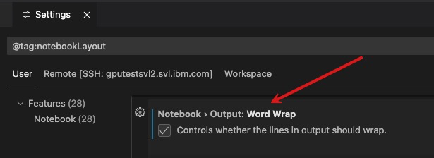
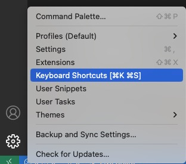

__jump to the beginning of a file__
Mac: `Cmd + Up`

__commment / uncomment__
`Cmd + /`

__jump to the end of a line__
`Cmd + Right Arrow`

__how to search a term within only a subdirectory__
1. open search tab: `Cmd + Shift + F`
2. Enter the path to the search directory. e.g., 


In this example, I am in the parent directory of QueryFormer. I want to search only within the files at QueryFormer.

__how to wrap long output in a Jupyter Notebook at VSCode__
I want to enable word wrap so that I can see the entire output without scrolling to the right. 

I clicked settings option from the top right part of the notebook. 


Next, I clicked `Customize Notebook Layout`


Finally, I toggled the following option in the notebook's setting:


__how to open a markdown file in preview mode__
`Cmd + Shift + V`

__Notebook cell - changing to code cell__
`y`

__Notebook cell - changing to markdown cell__
`m`

__creating a custom shortcut__
From the settings, select "Keyboard Shortcuts". Search for the target operation for which you want to create a new keyboard shortcut. Click the edit button (pencil icon). Next type a new key combination for the shortcut and press enter. 


__after creating a notebook(.ipynb) in a VSCode project, I kept seeing a message like the following__
`Install/Enable python extensions for Jupyter Notebok`

I fixed this issue with the following step:
From the extensions view, installed the following 2 extensions:
1. `Python` by Microsoft
2. `Jupyter` by Microsoft

__got this error message from Jupyter notebook cell execution__
`The kernel failed to start due to the missing module '_sqlite3'. Consider installing this module.`

I installed this OS package on my RHEL 9.2 system, however, I still kept seeing this error. After further investigation, I figured that this package 
needs to be installed on the RHEL system before building Python from the source. I uninstalled Python and re-installed it, this time sqlite was installed on the OS. Then the error was gone. I have documented the installation process in this [doc](../python/Python3.12.3-Instllation-RHEL9.2.md)

__on my RHEL 9.2 VM, I kept getting an error message that Pylance has crashed__
I kept getting this annoying message:
```Pylance has crashed. Would you like to try using a Node.js executable to run the language server?
```

In fixed it as follows:
1. Installed Node.js 20.x LTS:
```shell
curl -fsSL https://rpm.nodesource.com/setup_20.x | sudo bash -
```

```shell
sudo yum install -y nsolid
```

2. Verified the installation of node:
```shell
node -v
```

```shell
npm -v
```

3. Checked the path to the node executable:
```shell
which node
```

4. In VSCode settings, added the following:
{
    "terminal.integrated.shell.linux": "/usr/bin/zsh",
    "terminal.integrated.shellArgs.linux": ["-l"],
    "terminal.integrated.env.linux": {
        "PATH": "/usr/bin:${env:PATH}"
    }
}

I opened the settings.json as follows:
`Ctrl+Shift+P` and then typed `Open Settings (JSON)`.


# VSCode Insights
- In the editor panel, if you go to an open file, on the left file explorer that same file is selected. 
